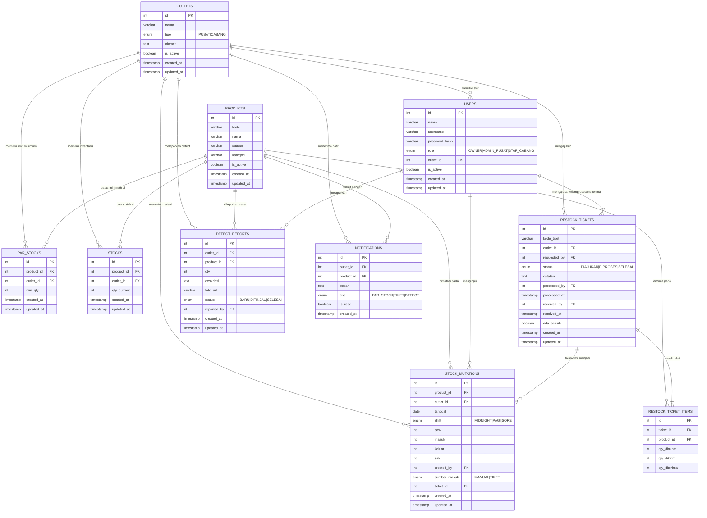

# Entity Relationship Diagram (ERD) - RichiStock

Berikut adalah diagram relasi entitas untuk database proyek RichiStock berdasarkan migrasi Fase 1.

```mermaid
erDiagram
    OUTLETS {
        int id PK
        varchar nama
        enum tipe "PUSAT|CABANG"
        text alamat
        boolean is_active
        timestamp created_at
        timestamp updated_at
    }

    USERS {
        int id PK
        varchar nama
        varchar username
        varchar password_hash
        enum role "OWNER|ADMIN_PUSAT|STAF_CABANG"
        int outlet_id FK
        boolean is_active
        timestamp created_at
        timestamp updated_at
    }

    PRODUCTS {
        int id PK
        varchar kode
        varchar nama
        varchar satuan
        varchar kategori
        boolean is_active
        timestamp created_at
        timestamp updated_at
    }

    PAR_STOCKS {
        int id PK
        int product_id FK
        int outlet_id FK
        int min_qty
        timestamp created_at
        timestamp updated_at
    }

    STOCKS {
        int id PK
        int product_id FK
        int outlet_id FK
        int qty_current
        timestamp created_at
        timestamp updated_at
    }

    STOCK_MUTATIONS {
        int id PK
        int product_id FK
        int outlet_id FK
        date tanggal
        enum shift "MIDNIGHT|PAGI|SORE"
        int saw
        int masuk
        int keluar
        int sak
        int created_by FK
        enum sumber_masuk "MANUAL|TIKET"
        int ticket_id FK
        timestamp created_at
        timestamp updated_at
    }

    RESTOCK_TICKETS {
        int id PK
        varchar kode_tiket
        int outlet_id FK
        int requested_by FK
        enum status "DIAJUKAN|DIPROSES|SELESAI"
        text catatan
        int processed_by FK
        timestamp processed_at
        int received_by FK
        timestamp received_at
        boolean ada_selisih
        timestamp created_at
        timestamp updated_at
    }

    RESTOCK_TICKET_ITEMS {
        int id PK
        int ticket_id FK
        int product_id FK
        int qty_diminta
        int qty_dikirim
        int qty_diterima
    }

    DEFECT_REPORTS {
        int id PK
        int outlet_id FK
        int product_id FK
        int qty
        text deskripsi
        varchar foto_url
        enum status "BARU|DITINJAU|SELESAI"
        int reported_by FK
        timestamp created_at
        timestamp updated_at
    }

    NOTIFICATIONS {
        int id PK
        int outlet_id FK
        int product_id FK
        text pesan
        enum tipe "PAR_STOCK|TIKET|DEFECT"
        boolean is_read
        timestamp created_at
    }

    %% Relationships
    OUTLETS ||--o{ USERS : "memiliki staf"
    OUTLETS ||--o{ PAR_STOCKS : "memiliki limit minimum"
    OUTLETS ||--o{ STOCKS : "memiliki inventaris"
    OUTLETS ||--o{ STOCK_MUTATIONS : "mencatat mutasi"
    OUTLETS ||--o{ RESTOCK_TICKETS : "mengajukan"
    OUTLETS ||--o{ DEFECT_REPORTS : "melaporkan defect"
    OUTLETS ||--o{ NOTIFICATIONS : "menerima notif"

    PRODUCTS ||--o{ PAR_STOCKS : "batas minimum di"
    PRODUCTS ||--o{ STOCKS : "posisi stok di"
    PRODUCTS ||--o{ STOCK_MUTATIONS : "dimutasi pada"
    PRODUCTS ||--o{ RESTOCK_TICKET_ITEMS : "diminta pada"
    PRODUCTS ||--o{ DEFECT_REPORTS : "dilaporkan cacat"
    PRODUCTS ||--o{ NOTIFICATIONS : "terkait dengan"

    USERS ||--o{ STOCK_MUTATIONS : "menginput"
    USERS ||--o{ RESTOCK_TICKETS : "mengajukan/memproses/menerima"
    USERS ||--o{ DEFECT_REPORTS : "melaporkan"

    RESTOCK_TICKETS ||--|{ RESTOCK_TICKET_ITEMS : "terdiri dari"
    RESTOCK_TICKETS ||--o{ STOCK_MUTATIONS : "dikonversi menjadi"
```
